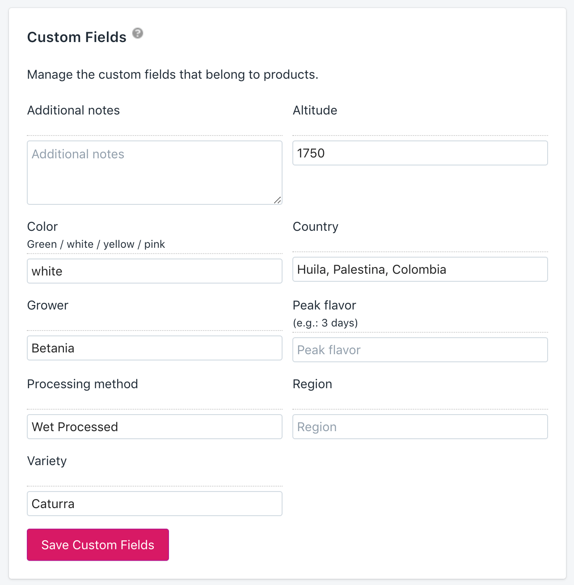
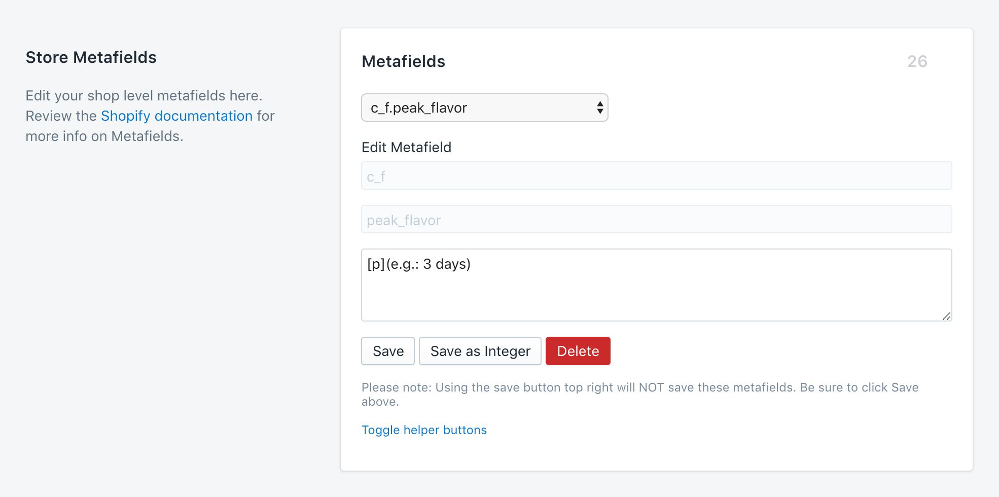

# Lineage 2017 Site

# Setup

```
npm i
```

## Development

Start the development server with

```
npm run start
```

and it will be available at `localhost:8080`, with mock data.

## Debugging

If on VSCode and using [Debugger for Chrome][vs-debugger-chrome], open a new
Terminal tab and run the following to allow breakpoints in VSCode:

```
npm run debug
```

_Note: it’s configured for Chrome Canary. Remove `\\ Canary` in `launch.json`
to configure for Chrome (stable)._

# Editing

## Metafields

This site makes use of Shopify’s native metafields, a dark and secret API.

### Shopify Users

For Shopify users, the best way to set metafields per-product is using the
[Custom Fields Chrome Extension][custom-fields-chrome]. Navigate to the product
or page to edit, and click the extension in Chrome to load the metafields.



### Theme Developers

For web devs, the easiest way to set custom fields is using the [Shopify FD
Dashboard Tool for Chrome][fd-dashboard-chrome].

To manage the fields, navigate to **Settings > General** and enable the
extension. You should see a “Metafields” pane appear.



- **Namespace** must be `c_f`. Nothing else will display for the Custom Fields tool.
- **Key** can be any snake_case name you’d like
- **Value** should consist of tags + description of the field (e.g.: `[p]Choose a color` is a field with instructions “Choose a color” that’s only available for `[p]`roducts)

| Name   | Description                       |
| :----- | :-------------------------------- |
| `[a]`  | limit display to articles only    |
| `[c]`  | limit display to collections only |
| `[g]`  | limit display to pages only       |
| `[p]`  | limit display to products only    |
| `[_c]` | mark as a collection field        |
| `[_t]` | mark as a textarea                |

# Deployment

Easy deployment is made possible via the [Shopify Theme
Kit][shopify-theme-kit]. Install that and generate a [private API key in
Shopify
admin](https://help.shopify.com/manual/apps/private-apps#generate-credentials-from-the-shopify-admin)
with **Read and write** access to theme templates and theme assets. Copy
`config.yml.example` to `config.yml` and fill in the missing details. Then
run:

```
npm run deploy
```

[custom-fields-chrome]: https://chrome.google.com/webstore/detail/custom-fields-for-shopify/alfplfpobekffinigeidgmmfjollghln/related?hl=en-GB
[fd-dashboard-chrome]: https://chrome.google.com/webstore/detail/shopifyfd-dashboard-tool/lffljkleilfpjlmcdnoaghhcbnemelge?hl=en
[shopify-theme-kit]: https://shopify.github.io/themekit/
[vs-code-debugger-chrome]: https://marketplace.visualstudio.com/items?itemName=msjsdiag.debugger-for-chrome
