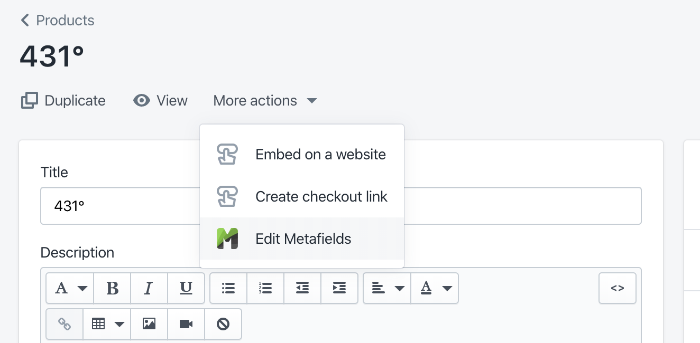

# Lineage 2017 Site

# Setup

```
npm i
```

## Development

Start the development server with

```
npm run start
```

and it will be available at `localhost:8080`, with mock data.

## Debugging

If on VSCode and using [Debugger for Chrome][vs-debugger-chrome], open a new Terminal tab and run
the following to allow breakpoints in VSCode:

```
npm run debug
```

_Note: it’s configured for Chrome Canary. Remove `\\ Canary` in `launch.json` to configure for
Chrome (stable)._

# Editing

## Coffee Notes

This site makes use of Shopify’s native metafields, a dark and secret API. Under “more actions” you
should see a **Edit Metafields** button on all products:

<p align="center"></p>

You’ll see many metafields that don’t pertain to coffee notes. Scroll down until you see **Namespace
`c_f`** fields like `country`, `processing_method`,`variety`,`color`, etc.

For creating new coffees, copy over the `c_f`-namespaced fields from another coffee product.

# Deployment

Easy deployment is made possible via the [Shopify Theme Kit][shopify-theme-kit]. Install that and
generate a
[private API key in Shopify admin](https://help.shopify.com/manual/apps/private-apps#generate-credentials-from-the-shopify-admin)
with **Read and write** access to theme templates and theme assets. Copy `config.yml.example` to
`config.yml` and fill in the missing details. Then run:

```
npm run deploy
```

[custom-fields-chrome]:
  https://chrome.google.com/webstore/detail/custom-fields-for-shopify/alfplfpobekffinigeidgmmfjollghln/related?hl=en-GB
[fd-dashboard-chrome]:
  https://chrome.google.com/webstore/detail/shopifyfd-dashboard-tool/lffljkleilfpjlmcdnoaghhcbnemelge?hl=en
[shopify-theme-kit]: https://shopify.github.io/themekit/
[vs-code-debugger-chrome]:
  https://marketplace.visualstudio.com/items?itemName=msjsdiag.debugger-for-chrome
